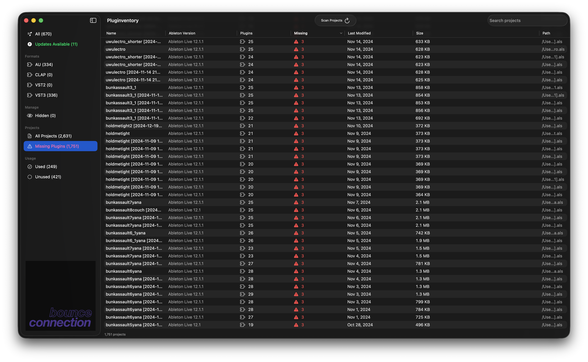

# Pluginventory

A native macOS app that catalogs every AU, CLAP, VST2, and VST3 plugin on your system, tracks version history, checks for updates, and shows you exactly which plugins each Ableton project depends on.


## Features

### Plugin Discovery & Management
- **Automatic scanning** of standard macOS audio plugin directories with real-time FSEvents monitoring
- **AU, CLAP, VST2, and VST3** format support with color-coded format badges
- **CPU architecture detection** — flags Apple Silicon, Intel 64, Universal, and legacy (i386/PowerPC) with warning badges
- **Sortable, searchable table** — 11 columns (name, vendor, format, installed version, available version, download, architecture, size, date added, projects, instances) with persistent sort order
- **Multi-select and bulk actions** — Cmd+click / Shift+click, then right-click to copy paths, copy full details, reveal in Finder, open publisher website, or hide/unhide
- **Detail inspector** — plugin image, version history, bundle ID, file path, architecture, download links

### Update Checking
- **Automatic version checking** — detects newer versions of your installed plugins and shows them in the Available column
- **Manifest caching** — cached entries display instantly on launch, then refresh in the background
- **Smart plugin identification** — intelligently finds publisher websites via plist metadata, reverse-domain lookup, and web search fallback

### Ableton Project Analysis
- **Scans .als project files** to identify which plugins each project uses (AU, VST3, VST2)
- **Missing plugin detection** — flags plugins referenced in projects but not installed on your system
- **Live streaming scan** — projects appear in the table incrementally as they're parsed
- **Project detail view** — plugins grouped by format with installed/missing status and instance counts



### Menu Bar & Monitoring
- **Menu bar extra** — quick access popover showing plugin count, update count, recent changes, and scan controls
- **Real-time file system monitoring** — detects plugin installs, updates, and removals via FSEvents with silent background rescans
- **Granular notifications** — separate toggles for new, updated, and removed plugin notifications

### Export & Shortcuts
- **CSV export** (Cmd+Shift+E) — name, vendor, format, version, bundle ID, path
- **Cmd+R** — scan and check for updates
- **Cmd+,** — settings

## Requirements

- macOS 14.0 (Sonoma) or later
- Xcode 16.0+ (to build from source)

## Installation

### Download

Download the latest `.pkg` installer from the [Releases page](https://github.com/bounceconnection/pluginventory/releases). Double-click to install to `/Applications`.

> **Note:** Builds are unsigned. If macOS blocks the installer, right-click the `.pkg` and choose **Open**.

### Build from Source

```bash
git clone https://github.com/bounceconnection/pluginventory.git
cd pluginventory/PluginUpdater
brew install xcodegen
xcodegen generate
open Pluginventory.xcodeproj
# Press Cmd+R to build and run
```

## Settings

Open with **Cmd+,**:

| Tab | What it controls |
|-----|-----------------|
| **Scan Paths** | Enable/disable default plugin directories, add custom scan locations |
| **Projects** | Ableton project folders, scan-on-launch toggle, folder monitoring |
| **Notifications** | Master toggle + individual new/updated/removed toggles |
| **General** | Auto-scan interval (15 min–6 hrs or manual), remote manifest URL, launch at login, image cache, app updates |

## Architecture

```
Pluginventory/
  App/                        # Entry point, observable state, scan orchestration
  Models/                     # SwiftData models (Plugin, AbletonProject, ScanLocation, etc.)
  Services/
    Scanner/                  # Plugin discovery, Ableton project parsing, plugin matching
    Monitoring/               # FSEvents file system monitoring
    Persistence/              # SwiftData reconciliation, vendor name normalization
    Notifications/            # macOS notification delivery
    Updates/                  # Homebrew API version checking, in-app update checker
  Views/
    Dashboard/                # Main table with multi-select, context menu, status bar
    Detail/                   # Plugin detail inspector
    Projects/                 # Ableton project list and detail views
    Settings/                 # Scan paths, notification preferences
    MenuBar/                  # Menu bar popover
    Components/               # Reusable UI components
  Utilities/                  # Constants, extensions
  Resources/                  # Cask mappings, default manifest, assets
```

**Key design decisions:**
- **SwiftData** for persistence — plugins, versions, projects, and scan locations stored locally
- **Actor-based concurrency** — scanner, reconciler, and version checker use Swift actors for thread safety
- **No third-party dependencies** — pure Swift/SwiftUI, ships as a single app bundle
- **Plugin identity keyed on CFBundleIdentifier** — not file path, so moved plugins track correctly

## Development

- **`main`** — stable releases. **`dev`** — integration branch. Feature branches off `dev`.
- CI runs on all PRs targeting `dev` or `main` and all pushes to `dev`.
- Releases: **Actions > Promote to Main > Run workflow** (auto-bumps patch, or specify `X.Y.Z`). Tags trigger the Release workflow which builds the `.pkg` installer.
- Versioning follows [SemVer](https://semver.org/).

## Troubleshooting

Enable verbose per-plugin matching logs:

```bash
defaults write com.bounceconnection.Pluginventory debugVerboseLogging -bool YES
```

Logs are written to `~/Library/Logs/Pluginventory/` (daily rolling, kept 7 days). To disable:

```bash
defaults delete com.bounceconnection.Pluginventory debugVerboseLogging
```

## License

[MIT License](LICENSE)
