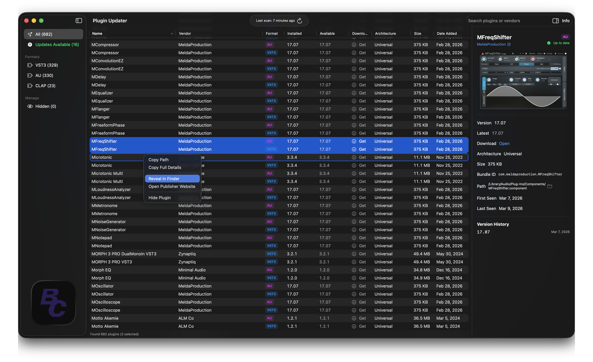

# Plugin Updater

A native macOS app that scans your installed audio plugins (VST3, AU, CLAP), tracks their versions, and automatically checks for available updates via the Homebrew Formulae API.


## Features

- **Automatic Plugin Discovery** — Scans standard macOS audio plugin directories and reads bundle metadata (CFBundleIdentifier, version, vendor)
- **Update Detection** — Queries the Homebrew Formulae API to find newer versions of your installed plugins
- **Format Support** — VST3, Audio Unit (AU), and CLAP plugin formats
- **Sortable Columns** — Sort by name, vendor, format, installed version, or available version to quickly find plugins that need updating
- **Sidebar Filtering** — Filter by format (VST3, AU, CLAP) or show only plugins with updates available
- **Detail Inspector** — View bundle ID, file path, version history, and download links for any plugin
- **Real-time Monitoring** — Uses FSEvents to detect plugin changes in the background and trigger incremental scans
- **Menu Bar Access** — Quick status view from the menu bar showing recent changes and update counts
- **Notifications** — Get notified when plugins are added, removed, or updated



## Requirements

- macOS 14.0 (Sonoma) or later
- Xcode 16.0+ (to build from source)

## Installation

### Download the Installer (easiest)

Download the latest **`.pkg` installer** from the [Releases page](https://github.com/bounceconnection/plugin-updater/releases):

1. Download `PluginUpdater-<version>.pkg`.
2. Double-click the file to launch the macOS Installer.
3. Follow the prompts — the app is installed to `/Applications`.

> **Gatekeeper note:** Builds from GitHub Actions are unsigned. If macOS blocks the installer, right-click the `.pkg` → **Open** → **Open** to proceed.

### Build from Source

1. Clone the repository:
   ```bash
   git clone https://github.com/yourusername/plugin-updater.git
   cd plugin-updater/PluginUpdater
   ```

2. Generate the Xcode project (requires [xcodegen](https://github.com/yonaskolb/XcodeGen)):
   ```bash
   brew install xcodegen
   xcodegen generate
   ```

3. Open and build:
   ```bash
   open PluginUpdater.xcodeproj
   ```
   Then press **Cmd+R** to build and run.

### Build the .pkg Installer Locally

```bash
# Requires Xcode command-line tools and xcodegen
brew install xcodegen
./scripts/build-installer.sh
# Output: build/PluginUpdater-1.0.0.pkg
```

### Alternative: Swift Package Manager

```bash
cd PluginUpdater
swift build
```

## Usage

1. **Launch the app** — On first run, it automatically scans the default plugin directories:
   - `/Library/Audio/Plug-Ins/Components/` (Audio Units)
   - `/Library/Audio/Plug-Ins/VST3/` (VST3)
   - `/Library/Audio/Plug-Ins/CLAP/` (CLAP)

2. **Scan for plugins** — Click the **Scan Now** button in the toolbar to rescan all directories.

3. **Check for updates** — After scanning, the app automatically queries the Homebrew Formulae API for newer versions. Plugins with available updates show a green version number in the **Available** column.

4. **Filter and sort** — Use the sidebar to filter by format or show only plugins with updates. Click any column header to sort.

5. **View details** — Select a plugin and click **Info** to open the detail inspector showing bundle ID, file path, version history, and download links.

6. **Add scan locations** — Go to **Settings** (Cmd+,) to add custom plugin directories.

## How Update Checking Works

Plugin Updater uses a mapping of plugin bundle ID prefixes to [Homebrew Cask](https://formulae.brew.sh/) names. When you scan, it:

1. Reads each plugin's `CFBundleIdentifier` and `CFBundleShortVersionString` from its `Info.plist`
2. Matches bundle IDs against known cask mappings (e.g., `com.fabfilter.Pro-Q` -> `fabfilter-pro-q`)
3. Queries `https://formulae.brew.sh/api/cask/<name>.json` for the latest version
4. Compares installed vs. latest and highlights available updates

Currently supported vendors for automatic update checking:
- FabFilter (14 products)
- Valhalla DSP (3 products)
- Soundtoys

The cask mappings file (`Resources/cask_mappings.json`) can be extended to support additional vendors.

## Architecture

```
PluginUpdater/
  App/
    PluginUpdaterApp.swift    # App entry point, all views
    AppState.swift            # Observable state, scan orchestration
  Models/                     # SwiftData models (Plugin, PluginVersion, ScanLocation, etc.)
  Services/
    Scanner/                  # Plugin discovery and metadata extraction
    Monitoring/               # FSEvents file system monitoring
    Persistence/              # SwiftData reconciliation
    Notifications/            # macOS notification delivery
    Updates/                  # Homebrew API version checking, manifest management
  Utilities/                  # Constants, URL/String extensions
  Resources/                  # Cask mappings, default manifest, assets
```

**Key design decisions:**
- **SwiftData** for persistence — plugins, versions, and scan locations stored locally
- **Actor-based concurrency** — scanner, reconciler, and version checker use Swift actors for thread safety
- **No third-party dependencies** — pure Swift/SwiftUI, ships as a single app bundle
- **Plugin identity keyed on CFBundleIdentifier** — not file path, so moved plugins are tracked correctly

## License

MIT
