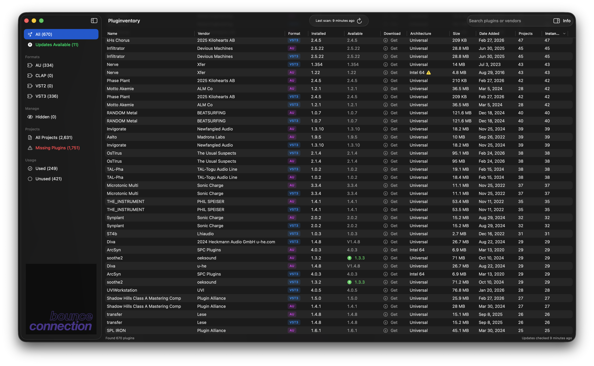

# Plugin Updater

A macOS app that scans your installed audio plugins (AU, CLAP, VST2, VST3), tracks versions, checks for updates, and analyzes Ableton Live projects to identify missing plugins.



## Features

- **Automatic Plugin Discovery** — Scans standard macOS audio plugin directories and reads bundle metadata (CFBundleIdentifier, version, vendor)
- **Update Detection** — Checks for newer versions of your installed plugins via the Homebrew Formulae API
- **Format Support** — Supports AU, CLAP, VST2, and VST3 plugin formats
- **Ableton Project Scanner** — Parses .als project files to identify which plugins each project uses and flags missing ones
- **Live Streaming Scan** — Projects appear in the table incrementally during scanning so you can start browsing immediately
- **Multi-Select & Bulk Actions** — Cmd+click or Shift+click to select multiple plugins, then right-click for bulk operations
- **Context Menu** — Copy Paths, Copy Full Details, Reveal in Finder, Open Publisher Website, and Hide/Unhide actions on any selection
- **CPU Architecture Detection** — Shows Apple Silicon, Intel 64, Universal, or legacy (Intel 32/PowerPC) status with warning badges
- **Sortable Columns** — Sorts by name, vendor, format, installed version, available version, architecture, size, or date added
- **Hide Plugins** — Right-click to hide plugins you don't care about; view and unhide them from the Hidden section in the sidebar
- **Sidebar Filtering** — Filters by format (AU, CLAP, VST2, VST3), updates available, used/unused plugins, or projects with missing plugins
- **Detail Inspector** — Shows architecture, size, bundle ID, file path, version history, and download links for any plugin
- **Real-time Monitoring** — Uses FSEvents to detect plugin changes in the background and triggers incremental scans
- **Menu Bar Access** — Provides a quick status view from the menu bar showing recent changes and update counts
- **Granular Notifications** — Separate toggles for new, updated, and removed plugin notifications

## Requirements

- macOS 14.0 (Sonoma) or later
- Xcode 16.0+ (to build from source)

## Installation

### Download

Download the latest `.pkg` installer from the [Releases page](https://github.com/bounceconnection/plugin_updater/releases). Double-click to install to `/Applications`.

> **Note:** Builds are unsigned. If macOS blocks the installer, right-click the `.pkg` → **Open** → **Open**.

### Build from Source

```bash
git clone https://github.com/bounceconnection/plugin_updater.git
cd plugin_updater/PluginUpdater
brew install xcodegen
xcodegen generate
open PluginUpdater.xcodeproj
# Press Cmd+R to build and run
```

## Usage

1. **Launch** — On first run, scans the default plugin directories (`/Library/Audio/Plug-Ins/`)
2. **Scan** — Click **Scan Now** in the toolbar to rescan
3. **Updates** — Plugins with newer versions show a green version in the **Available** column
4. **Filter** — Use the sidebar to filter by format, updates, or used/unused
5. **Inspect** — Select a plugin and click **Info** for bundle ID, path, version history, and download links
6. **Settings** — Press **Cmd+,** to add custom scan directories or configure notifications

## How Update Checking Works

Plugin Updater maps bundle ID prefixes to [Homebrew Cask](https://formulae.brew.sh/) names, queries the API for the latest version, and compares against your installed version. The mappings file (`Resources/cask_mappings.json`) can be extended for additional vendors.

## Architecture

```
PluginUpdater/
  App/                        # Entry point, observable state, scan orchestration
  Models/                     # SwiftData models (Plugin, AbletonProject, ScanLocation, etc.)
  Services/
    Scanner/                  # Plugin discovery, Ableton project parsing, plugin matching
    Monitoring/               # FSEvents file system monitoring
    Persistence/              # SwiftData reconciliation, vendor name normalization
    Notifications/            # macOS notification delivery
    Updates/                  # Homebrew API version checking, in-app update checker
  Views/
    Dashboard/                # Main table with multi-select, context menu, status bar
    Detail/                   # Plugin detail inspector
    Projects/                 # Ableton project list and detail views
    Settings/                 # Scan paths, notification preferences
    MenuBar/                  # Menu bar popover
    Components/               # Reusable UI components
  Utilities/                  # Constants, extensions
  Resources/                  # Cask mappings, default manifest, assets
```

**Key design decisions:**
- **SwiftData** for persistence — plugins, versions, and scan locations stored locally
- **Actor-based concurrency** — scanner, reconciler, and version checker use Swift actors for thread safety
- **No third-party dependencies** — pure Swift/SwiftUI, ships as a single app bundle
- **Plugin identity keyed on CFBundleIdentifier** — not file path, so moved plugins track correctly

## Development

- **`main`** — stable releases. **`dev`** — integration branch. Feature branches off `dev`.
- CI runs on all PRs targeting `dev` or `main` and all pushes to `dev`.
- Releases: **Actions → Promote to Main → Run workflow** (auto-bumps patch, or specify `X.Y.Z`). Tags trigger the Release workflow which builds the `.pkg` installer.
- Versioning follows [SemVer](https://semver.org/).

## Troubleshooting

Enable verbose per-plugin matching logs:

```bash
defaults write com.bounceconnection.PluginUpdater debugVerboseLogging -bool YES
```

Logs are written to `~/Library/Logs/PluginUpdater/` (daily rolling, kept 7 days). To disable:

```bash
defaults delete com.bounceconnection.PluginUpdater debugVerboseLogging
```

## License

[MIT License](LICENSE)
